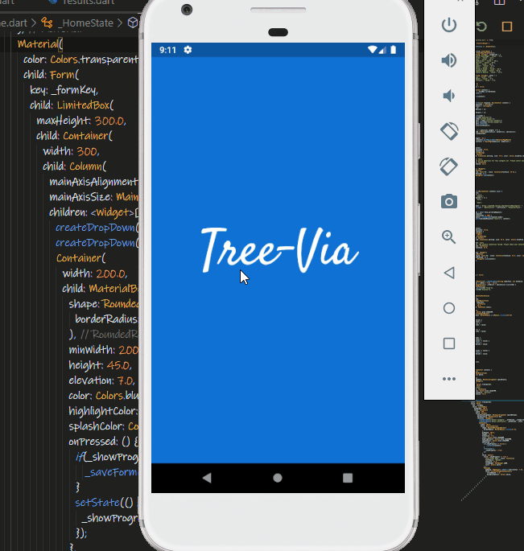

# Tree-Via App

## Mobile app built using Flutter.

## Use of asynchronous code to handle the timers. 

### Please point out any corrections in the code where you deem necessary.

### A demo of this app in action is shown below.

